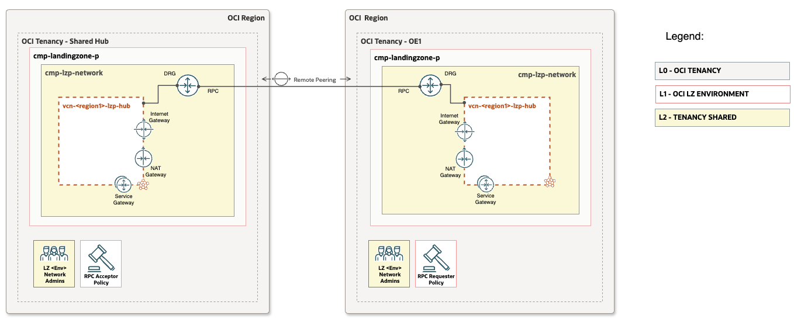

# **[OCI Cross Tenancy Remote Peering Connection configuration](#)**
## **An OCI Open LZ [Addon](#) to setup the cross tenancy remote peering conection uisng IaC**

&nbsp; 

&nbsp;

## **Overview**
This configuration enables to establish connectivity between two regions in same tenancy and across multiple tenancies, managed by a central network team. It includes all necessary RPC configurations, such as policy creation, RPC setup, and connection establishment. This approach ensures consistency, simplifies administration, and eliminates the complexity of managing RPC across multiple OCI tenancies.

This document provides configuration views for the following use cases:
- Multi-Tenancy-RPC: Establishes a remote peering connection between the same or different regions across multiple tenancies.
- Single-Tenancy-RPC: Establishes a remote peering connection between two regions within a single tenancy.

&nbsp;

### OCI crmultioss tenancy RPC resources

| Resource | Description |
| - | - |
| [IAM Policies](https://docs.oracle.com/en-us/iaas/Content/Identity/Concepts/policies.htm) | A set of policies is required to establish connectivity between two tenancies. These policies authorize and admit connectivity from different tenancies, ensuring secure and controlled access to networking resources. |
| [Remote Peering Connection (RPC)](https://docs.oracle.com/en-us/iaas/Content/Network/Tasks/drg-rpc-create.htm#drg-rpc-create) | A Remote Peering Connection (RPC) must be created in both tenancies to establish connectivity between them. This involves configuring a dynamic routing gateway (DRG) in each tenancy and setting up the necessary peerings. |

&nbsp;

### OCI X Tenancy RPC Setup
This guide provides step-by-step instructions for setting up a cross-tenancy Remote Peering Connection (RPC) in OCI. By following this guide, organizations can securely establish network connectivity between multiple tenancies, enabling seamless interconnectivity for distributed workloads. 

&nbsp;

## 1. Multi-Tenancy-RPC
&nbsp;
Configuration details:
  - Primary/Shared Hub tenancy conisits of the following resources and components
    - Dynamic Routing Gateway (DRG) and Remote Peering Connection (RPC)
    - IAM policy (Acceptor) statements to accept the remote peering connection from other/spoke tenancy. 
  - Child/Spoke Tenancy conisits of the following resources and components
    - Dynamic Routing Gateway (DRG) and Remote Peering Connection (RPC)
    - IAM policy (Requestor) statements to request the remote peering connection to the Primary/Shared Hub tenancy. 

&nbsp;

